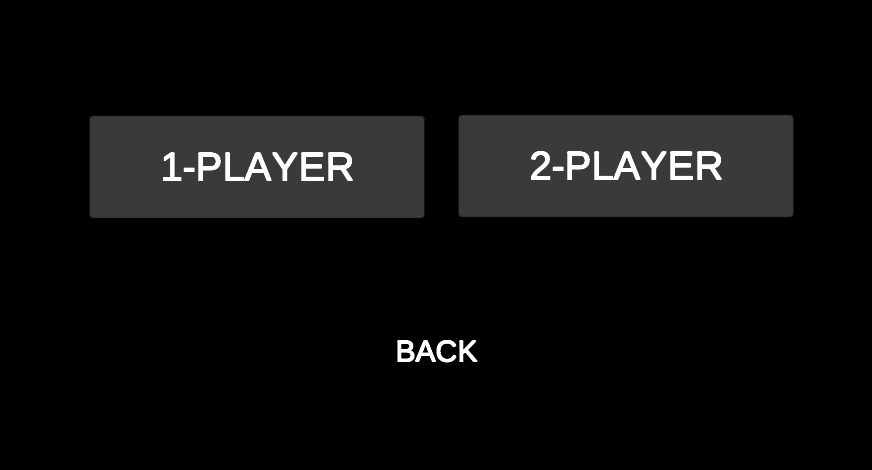
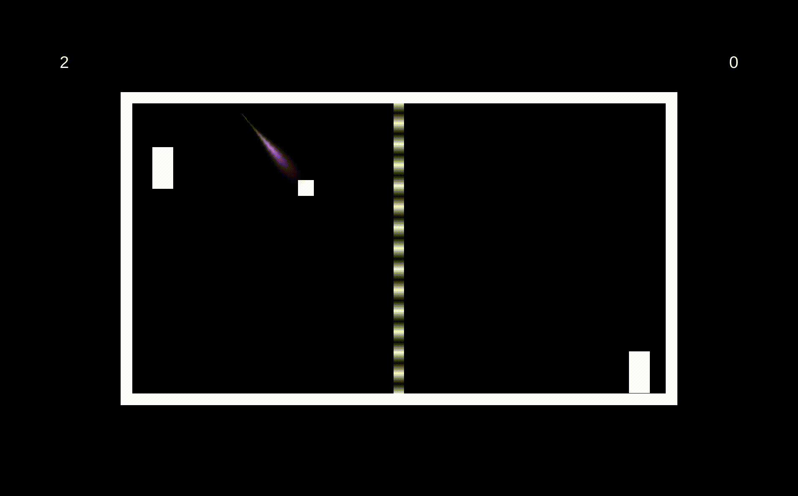

# PongClone

Extended from https://noobtuts.com/unity/2d-pong-game  
Stuff added that weren't in the tutorial: trail effect, gradually increasing speed, a controller for the left paddle in single player mode, scoreboard, menu, audio  

 

!
!
